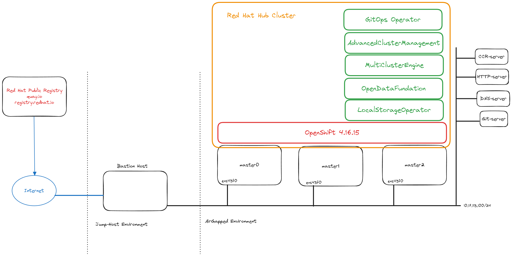

# L1-CloudPlatform

The purpose of this repo its to document all the steps in deploying a CloudPlatform which purpose its to deploy, manage and monitor a number of Spoke(s) OCP Clusters.

> [!CAUTION]
> Unless specified otherwise, everything contained in this repository is unsupported by Red Hat.

## Table of Contents
- [L1-CloudPlatform](#l1-cloudplatform)
  - [Table of Contents](#table-of-contents)
  - [Method of Procedure](#method-of-procedure)
    - [Prerequisites](#prerequisites)
      - [High Level Diagram of the Hub Set-up:](#high-level-diagram-of-the-hub-set-up)
    - [Step 0. Download the pre-requisites binaries](#step-0-download-the-pre-requisites-binaries)
    - [Step 1. Mirorring the OCI content for a disconnected installation using oc-mirror](#step-1-mirorring-the-oci-content-for-a-disconnected-installation-using-oc-mirror)
    - [Step 2. Mirroring the OCI content to a AirGapped Registry](#step-2-mirroring-the-oci-content-to-a-airgapped-registry)
    - [Step 3. Downloading the RHCOS to AirGapped HTTP(s) Server](#step-3-downloading-the-rhcos-to-airgapped-https-server)
    - [Step 4. Agent-based Installer](#step-4-agent-based-installer)
    - [Step 5. Hub Configuration](#step-5-hub-configuration)
    - [Step 6. Spoke deployment](#step-6-spoke-deployment)
  - [Troubleshooting](#troubleshooting)
  - [Conclusions](#conclusions)
    - [ArgoCD application management:](#argocd-application-management)
    - [No OSD pods are running in an OCS 4.x cluster, even when the OSD Prepare pods are in Completed state, Why?](#no-osd-pods-are-running-in-an-ocs-4x-cluster-even-when-the-osd-prepare-pods-are-in-completed-state-why)
  - [Results and Problems](#results-and-problems)

## Method of Procedure

### [Prerequisites](https://docs.openshift.com/container-platform/4.16/installing/installing_with_agent_based_installer/preparing-to-install-with-agent-based-installer.html)

In order to have a fully functional Hub Cluster and deploy Managed/Spoke(s) Clusters ensure your environment meets the following [prerequisites](https://docs.openshift.com/container-platform/4.16/installing/installing_with_agent_based_installer/preparing-to-install-with-agent-based-installer.html):

- [AirGapped Registry](https://docs.openshift.com/container-platform/4.16/installing/disconnected_install/installing-mirroring-creating-registry.html)

_Download and install a local, minimal single instance deployment of Red Hat Quay to aid bootstrapping the first disconnected cluster. [Learn more](https://docs.openshift.com/container-platform/4.17/disconnected/mirroring/installing-mirroring-installation-images.html#installation-about-mirror-registry_installing-mirroring-installation-images)_

- AirGapped HTTP(s) Server

_Install a local, minimal single instance deployment of an http-server to aid bootstrapping the first Hub and for Managed/Spoke(s) Disconnected Cluster(s)._

- Git-Server

_Install a local, minimal single instance deployment of an git-server to aid the Hub day2-operators deployment + configuration and bootstrapping the Managed/Spoke(s) Disconnected Cluster(s)._

- DNS-Server

#### High Level Diagram of the Hub Set-up:



### Step 0. Download the pre-requisites binaries

- Ensure my environment has `oc-mirror` client:
```bash
curl -L https://mirror.openshift.com/pub/openshift-v4/clients/ocp/4.16.15/oc-mirror.tar.gz | tar -xz && chmod +x oc-mirror
```
Installing the [oc-mirror](https://docs.openshift.com/container-platform/4.16/installing/disconnected_install/installing-mirroring-disconnected.html#installing-mirroring-disconnected) OpenShift CLI plugin. 

- Ensure my environment has `oc` client:
```bash
curl -LO https://mirror.openshift.com/pub/openshift-v4/clients/ocp/4.16.15/openshift-client-linux-4.16.15.tar.gz && tar -xzf openshift-client-linux-4.16.15.tar.gz && chmod +x oc kubectl
```

### Step 1. Mirorring the OCI content for a [disconnected installation using oc-mirror](https://docs.openshift.com/container-platform/4.16/installing/disconnected_install/installing-mirroring-disconnected.html)

> [!WARNING]
> Ensure to include in your `config.json` the pull-secret of your AirGapped Registry and Red Hat public [pull-secret](https://console.redhat.com/openshift/install/pull-secret).

Once we have all the prerequisite met on the system, lets proceed in creating the [imageset-config.yml](./imageset-config.yml) file:

Example for `advanced-cluster-management`: 
```bash
# DOCKER_CONFIG=/root/.docker/; ./oc-mirror list operators --catalog registry.redhat.io/redhat/redhat-operator-index:v4.16 --package=advanced-cluster-management

NAME                         DISPLAY NAME                                DEFAULT CHANNEL
advanced-cluster-management  Advanced Cluster Management for Kubernetes  release-2.12

PACKAGE                      CHANNEL       HEAD
advanced-cluster-management  release-2.10  advanced-cluster-management.v2.10.6
advanced-cluster-management  release-2.11  advanced-cluster-management.v2.11.3
advanced-cluster-management  release-2.12  advanced-cluster-management.v2.12.0
```
In order to validate all the day2-operators default channel version an example its provided in [process_packages.sh](./process_packages.sh), the script its producing the following output:

```bash
# ./process_packages.sh
Processing package: advanced-cluster-management
NAME                         DISPLAY NAME                                DEFAULT CHANNEL
advanced-cluster-management  Advanced Cluster Management for Kubernetes  release-2.12

PACKAGE                      CHANNEL       HEAD
advanced-cluster-management  release-2.10  advanced-cluster-management.v2.10.6
advanced-cluster-management  release-2.11  advanced-cluster-management.v2.11.3
advanced-cluster-management  release-2.12  advanced-cluster-management.v2.12.0
Processing package: multicluster-engine
NAME                 DISPLAY NAME                        DEFAULT CHANNEL
multicluster-engine  multicluster engine for Kubernetes  stable-2.7

PACKAGE              CHANNEL     HEAD
multicluster-engine  stable-2.5  multicluster-engine.v2.5.7
multicluster-engine  stable-2.6  multicluster-engine.v2.6.3
multicluster-engine  stable-2.7  multicluster-engine.v2.7.1
Processing package: topology-aware-lifecycle-manager
NAME                              DISPLAY NAME                      DEFAULT CHANNEL
topology-aware-lifecycle-manager  Topology Aware Lifecycle Manager  stable

PACKAGE                           CHANNEL  HEAD
topology-aware-lifecycle-manager  4.16     topology-aware-lifecycle-manager.v4.16.2
topology-aware-lifecycle-manager  stable   topology-aware-lifecycle-manager.v4.16.2
Processing package: openshift-gitops-operator
NAME                       DISPLAY NAME              DEFAULT CHANNEL
openshift-gitops-operator  Red Hat OpenShift GitOps  latest

PACKAGE                    CHANNEL      HEAD
openshift-gitops-operator  gitops-1.10  openshift-gitops-operator.v1.10.6
openshift-gitops-operator  gitops-1.11  openshift-gitops-operator.v1.11.7-0.1724840231.p
openshift-gitops-operator  gitops-1.12  openshift-gitops-operator.v1.12.6
openshift-gitops-operator  gitops-1.13  openshift-gitops-operator.v1.13.3
openshift-gitops-operator  gitops-1.14  openshift-gitops-operator.v1.14.2
openshift-gitops-operator  gitops-1.6   openshift-gitops-operator.v1.6.6
openshift-gitops-operator  gitops-1.7   openshift-gitops-operator.v1.7.4-0.1690486082.p
openshift-gitops-operator  gitops-1.8   openshift-gitops-operator.v1.8.6
openshift-gitops-operator  gitops-1.9   openshift-gitops-operator.v1.9.4
openshift-gitops-operator  latest       openshift-gitops-operator.v1.14.2
Processing package: odf-operator
NAME          DISPLAY NAME               DEFAULT CHANNEL
odf-operator  OpenShift Data Foundation  stable-4.16

PACKAGE       CHANNEL      HEAD
odf-operator  stable-4.15  odf-operator.v4.15.8-rhodf
odf-operator  stable-4.16  odf-operator.v4.16.3-rhodf
Processing package: ocs-operator
NAME          DISPLAY NAME                 DEFAULT CHANNEL
ocs-operator  OpenShift Container Storage  stable-4.16

PACKAGE       CHANNEL      HEAD
ocs-operator  stable-4.15  ocs-operator.v4.15.8-rhodf
ocs-operator  stable-4.16  ocs-operator.v4.16.3-rhodf
Processing package: odf-csi-addons-operator
NAME                     DISPLAY NAME  DEFAULT CHANNEL
odf-csi-addons-operator  CSI Addons    stable-4.16

PACKAGE                  CHANNEL      HEAD
odf-csi-addons-operator  stable-4.15  odf-csi-addons-operator.v4.15.8-rhodf
odf-csi-addons-operator  stable-4.16  odf-csi-addons-operator.v4.16.3-rhodf
Processing package: local-storage-operator
NAME                    DISPLAY NAME   DEFAULT CHANNEL
local-storage-operator  Local Storage  stable

PACKAGE                 CHANNEL  HEAD
local-storage-operator  stable   local-storage-operator.v4.16.0-202411190033
Processing package: mcg-operator
NAME          DISPLAY NAME     DEFAULT CHANNEL
mcg-operator  NooBaa Operator  stable-4.16

PACKAGE       CHANNEL      HEAD
mcg-operator  stable-4.15  mcg-operator.v4.15.8-rhodf
mcg-operator  stable-4.16  mcg-operator.v4.16.3-rhodf
Processing package: cluster-logging
NAME             DISPLAY NAME               DEFAULT CHANNEL
cluster-logging  Red Hat OpenShift Logging  stable-6.1

PACKAGE          CHANNEL     HEAD
cluster-logging  stable      cluster-logging.v5.9.9
cluster-logging  stable-5.8  cluster-logging.v5.8.15
cluster-logging  stable-5.9  cluster-logging.v5.9.9
cluster-logging  stable-6.0  cluster-logging.v6.0.2
cluster-logging  stable-6.1  cluster-logging.v6.1.0
Processing package: odf-prometheus-operator
NAME                     DISPLAY NAME         DEFAULT CHANNEL
odf-prometheus-operator  Prometheus Operator  stable-4.16

PACKAGE                  CHANNEL      HEAD
odf-prometheus-operator  stable-4.16  odf-prometheus-operator.v4.16.3-rhodf
Processing package: recipe
NAME    DISPLAY NAME  DEFAULT CHANNEL
recipe  Recipe        stable-4.16

PACKAGE  CHANNEL      HEAD
recipe   stable-4.16  recipe.v4.16.3-rhodf
Processing package: rook-ceph-operator
NAME                DISPLAY NAME  DEFAULT CHANNEL
rook-ceph-operator  Rook-Ceph     stable-4.16

PACKAGE             CHANNEL      HEAD
rook-ceph-operator  stable-4.16  rook-ceph-operator.v4.16.3-rhodf
All packages processed.
```
Utilize the values obtained during the `day2-operator` package inspection to verify that the `DEFAULT CHANNEL` is correctly templated in the [imageset-config.yml](./imageset-config.yml) file. Once validated, proceed with the mirroring process:

```bash
# DOCKER_CONFIG=${HOME}/.docker/config.json; ./oc-mirror --config imageset-config.yml file:///apps/idumi/
Creating directory: home/oc-mirror-workspace/src/publish
Creating directory: home/oc-mirror-workspace/src/v2
Creating directory: home/oc-mirror-workspace/src/charts
Creating directory: home/oc-mirror-workspace/src/release-signatures
backend is not configured in imageset-config.yaml, using stateless mode
backend is not configured in imageset-config.yaml, using stateless mode
No metadata detected, creating new workspace
..redacted..
info: Mirroring completed in 2h3m21.48s (9.416MB/s)
Creating archive /apps/idumi/mirror_seq1_000000.tar
Creating archive /apps/idumi/mirror_seq1_000001.tar
Creating archive /apps/idumi/mirror_seq1_000002.tar
Creating archive /apps/idumi/mirror_seq1_000003.tar
Creating archive /apps/idumi/mirror_seq1_000004.tar
Creating archive /apps/idumi/mirror_seq1_000005.tar
Creating archive /apps/idumi/mirror_seq1_000006.tar
Creating archive /apps/idumi/mirror_seq1_000007.tar
Creating archive /apps/idumi/mirror_seq1_000008.tar
Creating archive /apps/idumi/mirror_seq1_000009.tar
Creating archive /apps/idumi/mirror_seq1_000010.tar
Creating archive /apps/idumi/mirror_seq1_000011.tar
Creating archive /apps/idumi/mirror_seq1_000012.tar

```
> [!WARNING]
> The message `info: Mirroring completed in 2h3m21.48s (9.416MB/s)` is provided as an illustrative example and should not be interpreted as a definitive benchmark. Actual performance may vary depending on factors such as internet broadband speed, network latency, disk performance, and other environmental conditions.

The full mirroring logs can be reffer at [.oc-mirror.log](./.oc-mirror.log)
Once the mirroring process has ended, the following content has been created:
```bash

```

For any reference of the [imageset-config.yml](./imageset-config.yml).

> [!WARNING]
> In order to ensure that we adhere to the latest `day2-operator` channel used, ensure that your `imageset-config.yaml` content its allign the content reflected by running:
>
> ```bash
> oc-mirror list operators --catalog=registry.redhat.io/redhat/redhat-operator-index:v4.16 --package=advanced-cluster-management
> Logging to .oc-mirror.log
> NAME                         DISPLAY NAME                                DEFAULT CHANNEL
> advanced-cluster-management  Advanced Cluster Management for Kubernetes  release-2.12
> 
> PACKAGE                      CHANNEL       HEAD
> advanced-cluster-management  release-2.10  advanced-cluster-management.v2.10.6
> advanced-cluster-management  release-2.11  advanced-cluster-management.v2.11.3
> advanced-cluster-management  release-2.12  advanced-cluster-management.v2.12.0
> ```
> As outlined in the above example, the [imageset-config.yml](./imageset-config.yml) used in week46-2024 it was refering the `release-2.11` default channel for the `advanced-cluster-management`, in order to adhere to the latest changes, use the [imageset-config-w47.yml](./imageset-config-w47.yml).


### Step 2. Mirroring the OCI content to a AirGapped Registry
```bash
# DOCKER_CONFIG=${HOME}/.docker/config.json;  \
    ./oc-mirror --from=./mnt/d/l1-cp/ docker://registry.example:5000 
```

The following table privides an overview of the ammount of disk space required for the AirGapped Registry + a 10% overhead when mirroring the [imageset-config.yaml](./imageset-config.yml) :

| Version | Storage Required | Notes |
| --- | --- | --- |
| Cluster Release Operators 4.16.15 | ~ 20 GiB  | A single Release  |
| RHACM day2-operators | ~ 50 GiB | A single Release of RHACM Day2 Operators [imageset-config.yml](./imageset-config.yml)
| Additional troubleshooting OCI(s)| ~ 4 GiB | A single Release | 
| **Total**| **74 GiB** | 


### Step 3. Downloading the RHCOS to AirGapped HTTP(s) Server

The [rhcos sources for deploying Managed/Spoke(s) 4.16 Clusters](https://mirror.openshift.com/pub/openshift-v4/x86_64/dependencies/rhcos/4.16/4.16.3/) its 

Ensure that you are downloading the following content:
- [rhcos-4.16.0-x86_64-live-rootfs.x86_64.img](https://mirror.openshift.com/pub/openshift-v4/x86_64/dependencies/rhcos/4.16/4.16.3/rhcos-4.16.3-x86_64-live-rootfs.x86_64.img)
- [rhcos-4.16.0-x86_64-live.x86_64.iso](https://mirror.openshift.com/pub/openshift-v4/x86_64/dependencies/rhcos/4.16/4.16.3/rhcos-4.16.3-x86_64-live.x86_64.iso)

And store them to your AirGapped HTTP(s) Server, this content its required while configuring [multicluster-engine](./hub-config/operators-config/01_ai_config.yaml) operator.


### Step 4. [Agent-based Installer](https://docs.redhat.com/en/documentation/openshift_container_platform/4.16/html-single/installing_an_on-premise_cluster_with_the_agent-based_installer/index#about-the-agent-based-installer)


- Generating the `oc` client:

```bash
# ./oc adm release extract -a .docker/config.json \
     --command=oc registry.example:5000/ocp-release:4.16.15-x86_64 
```

- Generating the `openshift-install` client:

```bash
# ./oc adm release extract -a .docker/config.json \
     --command=openshift-install registry.example:5000/ocp-release:4.16.15-x86_64  
```

- Generating the [workingdir](./workingdir/) directory structure:

```bash
# mkdir -p ${HOME}/workingdir
# tree ${HOME}/workingdir
.
├── agent-config.yaml
├── install-config.yaml
└── openshift
    ├── 99-masters-chrony-configuration.yaml
    ├── 99_01_argo.yaml
    ├── catalogSource-cs-redhat-operator-index.yaml
    ├── disable-operatorhub.yaml
    └── imageContentSourcePolicy.yaml

2 directories, 7 files
```
Explaining all the parameters of the [install-config.yaml](./workingdir/install-config.yaml), you can use the following approach:
```bash
# ./openshift-install explain installconfig.platform.baremetal
KIND:     InstallConfig
VERSION:  v1

RESOURCE: <object>
  BareMetal is the configuration used when installing on bare metal.

FIELDS:
    apiVIP <string>
      Format: ip
      DeprecatedAPIVIP is the VIP to use for internal API communication Deprecated: Use APIVIPs

    apiVIPs <[]string>
      Format: ip
      APIVIPs contains the VIP(s) to use for internal API communication. In dual stack clusters it contains an IPv4 and IPv6 address, otherwise only one VIP

    bootstrapExternalStaticGateway <string>
      Format: ip
      BootstrapExternalStaticGateway is the static network gateway of the bootstrap node. This can be useful in environments without a DHCP server.

    bootstrapExternalStaticIP <string>
      Format: ip
      BootstrapExternalStaticIP is the static IP address of the bootstrap node. This can be useful in environments without a DHCP server.

    bootstrapOSImage <string>
      BootstrapOSImage is a URL to override the default OS image for the bootstrap node. The URL must contain a sha256 hash of the image e.g https://mirror.example.com/images/qemu.qcow2.gz?sha256=a07bd...

    bootstrapProvisioningIP <string>
      Format: ip
      BootstrapProvisioningIP is the IP used on the bootstrap VM to bring up provisioning services that are used to create the control-plane machines

    clusterOSImage <string>
      ClusterOSImage is a URL to override the default OS image for cluster nodes. The URL must contain a sha256 hash of the image e.g https://mirror.example.com/images/metal.qcow2.gz?sha256=3b5a8...

    clusterProvisioningIP <string>
      ClusterProvisioningIP is the IP on the dedicated provisioning network where the baremetal-operator pod runs provisioning services, and an http server to cache some downloaded content e.g RHCOS/IPA images

    defaultMachinePlatform <object>
      DefaultMachinePlatform is the default configuration used when installing on bare metal for machine pools which do not define their own platform configuration.

    externalBridge <string>
      External bridge is used for external communication.

    externalMACAddress <string>
      ExternalMACAddress is used to allow setting a static unicast MAC address for the bootstrap host on the external network. Consider using the QEMU vendor prefix `52:54:00`. If left blank, libvirt will generate one for you.

    hosts <[]object> -required-
      Hosts is the information needed to create the objects in Ironic.
      Host stores all the configuration data for a baremetal host.

    ingressVIP <string>
      Format: ip
      DeprecatedIngressVIP is the VIP to use for ingress traffic Deprecated: Use IngressVIPs

    ingressVIPs <[]string>
      Format: ip
      IngressVIPs contains the VIP(s) to use for ingress traffic. In dual stack clusters it contains an IPv4 and IPv6 address, otherwise only one VIP

    libvirtURI <string>
      Default: "qemu:///system"
      LibvirtURI is the identifier for the libvirtd connection.  It must be reachable from the host where the installer is run. Default is qemu:///system

    provisioningBridge <string>
      Provisioning bridge is used for provisioning nodes, on the host that will run the bootstrap VM.

    provisioningDHCPExternal <boolean>
      DeprecatedProvisioningDHCPExternal indicates that DHCP is provided by an external service. This parameter is replaced by ProvisioningNetwork being set to "Unmanaged".

    provisioningDHCPRange <string>
      ProvisioningDHCPRange is used to provide DHCP services to hosts for provisioning.

    provisioningHostIP <string>
      DeprecatedProvisioningHostIP is the deprecated version of clusterProvisioningIP. When the baremetal platform was initially added to the installer, the JSON field for ClusterProvisioningIP was incorrectly set to "provisioningHostIP."  This field is here to allow backwards-compatibility.

    provisioningMACAddress <string>
      ProvisioningMACAddress is used to allow setting a static unicast MAC address for the bootstrap host on the provisioning network. Consider using the QEMU vendor prefix `52:54:00`. If left blank, libvirt will generate one for you.

    provisioningNetwork <string>
      Default: "Managed"
      Valid Values: "","Managed","Unmanaged","Disabled"
      ProvisioningNetwork is used to indicate if we will have a provisioning network, and how it will be managed.

    provisioningNetworkCIDR <Any>
      ProvisioningNetworkCIDR defines the network to use for provisioning.

    provisioningNetworkInterface <string>
      ProvisioningNetworkInterface is the name of the network interface on a control plane baremetal host that is connected to the provisioning network.
```

- Installing the [nmstatectl](https://docs.openshift.com/container-platform/4.16/installing/installing_with_agent_based_installer/installing-with-agent-based-installer.html#installing-ocp-agent-inputs_installing-with-agent-based-installer) on the host:
```bash
# dnf install /usr/bin/nmstatectl -y
```
- Generating the `.iso` content:

> [!WARNING]
> Ensure at this stage to create a local back-up of your `workingdir/`. This is important in case of any required troubleshooting because the `openshift-install agent create image` will "consume" the files to generate the *agent.x86_64.iso* .
> 
```bash
# ./openshift-install agent create image --dir ${HOME}/workingdir/. --log-level debug
```
Once the `agent.x86_64.iso` file has been generated, mount it to the Server(s) BMC and boot from it.

```bash
$ tree .
.
├── agent.x86_64.iso
├── auth
│   ├── kubeadmin-password
│   └── kubeconfig
├── oc                  # (optional: This binary can be also store under /usr/local/bin/)
├── openshift-install   # (optional: This binary can be also store under /usr/local/bin/)
└── rendezvousIP

1 directory, 6 files
```
> [!WARNING]
> Ensure at this stage to NOT remove the `./auth/{kubeadmin-password, kubeconfig}` because this will prevent the administrator to access the cluster.
>

- [Monitoring the installation process](https://docs.openshift.com/container-platform/4.16/installing/installing_with_agent_based_installer/installing-with-agent-based-installer.html#installing-ocp-agent-verify_installing-with-agent-based-installer):
```bash
./openshift-install --dir ${HOME}/workingdir/. agent wait-for install-complete \
    --log-level=info
```
### Step 5. [Hub Configuration](https://docs.redhat.com/en/documentation/red_hat_openshift_gitops/1.12/html-single/argo_cd_applications/index)

Once the Hub Cluster OCP and `openshift-gitop-operator` are fully deploy, you can proceed by creating the Hub Configuration ArgoCD Applications:

- Label the Storage nodes of your Hub Cluster:
```bash
# oc label nodes master{0,1,2} cluster.ocs.openshift.io/openshift-storage=""
```
Ensure that the nodes that are 
- Create the [Hub ArgoCD Applications](./hub-config/hub-operators-argoapps.yaml):
```bash
# oc create -f ./hub-config/hub-operators-argoapps.yaml
```
> [!WARNING]
> Ensure that the Git-Server values are set according to your system for [hub-operators-argoapps.yaml](./hub-config/hub-operators-argoapps.yaml).
>
> Example used: 
> ```bash
> path: hub-config/operators-deployment
> repoURL: 'git@10.23.223.72:/home/git/acm.git'
> targetRevision: master
> ```

### Step 6. [Spoke deployment](https://docs.redhat.com/en/documentation/openshift_container_platform/4.16/html/edge_computing/ztp-deploying-far-edge-sites#ztp-deploying-far-edge-sites)

In this section we are going to outline the steps required to achieve a first RHACM Managed/Spoke(s) Deployment.

Before applying the ArgoCD for managing the policies and managed clusters, ensure to patch the ArgoCD:

```bash
# oc patch argocd openshift-gitops -n openshift-gitops --type=merge --patch-file ./hub-config/argocd/argocdpatch.json
 ```

- Create the [Spoke ArgoCD Applications](./hub-config/spoke-argoapps.yaml):
```bash
# oc create -f ./hub-config/spoke-argoapps.yaml
```
> [!WARNING]
> Ensure that the Git-Server values are set according to your system for [spoke-argoapps.yaml](./hub-config/spoke-argoapps.yaml).
>


## Troubleshooting

Ensure to collect the following logs if the [AgentBasedInstaller fails during the installation](https://docs.openshift.com/container-platform/4.16/installing/installing_with_agent_based_installer/installing-with-agent-based-installer.html#installing-ocp-agent-gather-log_installing-with-agent-based-installer)

## Conclusions

### ArgoCD application management:

This can be easly achieved by using the `argocd` [client](https://argo-cd.readthedocs.io/en/stable/cli_installation/). 
  
- How to use the `argocd` client to interact with `gitops-operator` from `RHACM Hub Cluster` ?

*Answer:*

  - Obtain the `ArgoCD Password`:
```bash
# ARGOCD_PASS=$(oc get secret -n openshift-gitops openshift-gitops-cluster -o jsonpath='{.data.admin\.password}' | base64 --decode)
```
  - Obtain the `ArgoCD` Address:
```bash
# ARGOCD_ROUTE=$(oc get routes -n openshift-gitops -o jsonpath='{.items[?(@.metadata.name=="openshift-gitops-server")].spec.host}')
```
You can check the content fo the `ARGOCD_PASS` bash variable as follows:

```bash
# echo $ARGOCD_PASS
fAktrva8iwMBNFg9Wy5o4lnDHQs2zCZb
```

- Login to the `openshift-gitops` operator through `argocd` client:

```bash
# argocd login $ARGOCD_ROUTE
WARNING: server certificate had error: tls: failed to verify certificate: x509: certificate signed by unknown authority. Proceed insecurely (y/n)? y
WARN[0003] Failed to invoke grpc call. Use flag --grpc-web in grpc calls. To avoid this warning message, use flag --grpc-web.
Username: admin
Password:
'admin:login' logged in successfully
Context 'openshift-gitops-server-openshift-gitops.apps.hub.example.com' updated
```

- Synchronize the ArgoCD Application

```bash
argocd app sync clusters --force --prune
```

### No OSD pods are running in an OCS 4.x cluster, even when the [OSD Prepare pods are in Completed state](https://access.redhat.com/solutions/6910101), Why?

If you are redeploying the OCP Cluster and the application disks were previously used by another Ceph Cluster, ensure to perform the clean-up.

```bash
# sgdisk --zap-all /dev/sdb && sudo wipefs -a /dev/sdb
```

## Results and Problems

- It has not created the [gitops_service_cluster.yaml](./hub-config/operators-config/gitops_service_cluster.yaml).
- Once the ODF Hub Cluster its created, ensure the following steps are done:
  
  - master nodes gets labeled as below:
```bash
# oc label nodes master{0,1,2} cluster.ocs.openshift.io/openshift-storage=""
```
  - ensure that the application disks gets cleaned up:
```bash
# sgdisk --zap-all /dev/sdb && sudo wipefs -a /dev/sdb
```