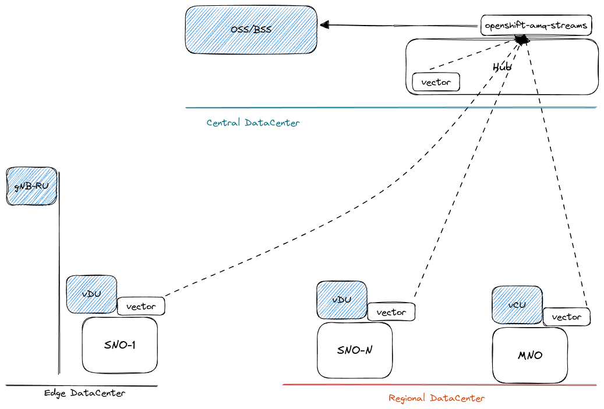

# Configuring Cluster Logging Operator to Forward Logs to an External Store in OpenShift 4

This guide covers the configuration of the Cluster Logging Operator in OpenShift 4 to forward logs to an external log store.

The configuration covers the following High Level Diagram use-case: 




## Table of content
- [Configuring Cluster Logging Operator to Forward Logs to an External Store in OpenShift 4](#configuring-cluster-logging-operator-to-forward-logs-to-an-external-store-in-openshift-4)
  - [Table of content](#table-of-content)
  - [Environmental details](#environmental-details)
  - [Configuring the `openshift-cluster-logging` operator](#configuring-the-openshift-cluster-logging-operator)
  - [Configuring the `openshift-kafka` operator:](#configuring-the-openshift-kafka-operator)

## Environmental details

- OpenShift version 4.17.15
- Cluster logging:
    - version 5.8.5
    - version 6.1.1
- AMQ-Streams:
    - version 2.8.0-0-0.1738265624.p

## Configuring the `openshift-cluster-logging` operator

- Installing the `openshift-cluster-logging` operator:
```bash
oc create -f 99_02_openshift-cluster-logging.yaml
```

The [99_02_openshift-cluster-logging.yaml](./99_02_openshift-cluster-logging.yaml) has been created to cover any versions of the CLO. 


- Verification of the `openshift-cluster-logging` operator:
```bash
[root@INBACRNRDL0102 ~]# oc get csv -n openshift-logging -w
NAME                     DISPLAY                     VERSION   REPLACES                 PHASE
cluster-logging.v5.8.5   Red Hat OpenShift Logging   5.8.5     cluster-logging.v5.8.4   
cluster-logging.v5.8.5   Red Hat OpenShift Logging   5.8.5     cluster-logging.v5.8.4   
cluster-logging.v5.8.5   Red Hat OpenShift Logging   5.8.5     cluster-logging.v5.8.4   
cluster-logging.v5.8.5   Red Hat OpenShift Logging   5.8.5     cluster-logging.v5.8.4   Pending
cluster-logging.v5.8.5   Red Hat OpenShift Logging   5.8.5     cluster-logging.v5.8.4   Pending
cluster-logging.v5.8.5   Red Hat OpenShift Logging   5.8.5     cluster-logging.v5.8.4   Pending
cluster-logging.v5.8.5   Red Hat OpenShift Logging   5.8.5     cluster-logging.v5.8.4   InstallReady
cluster-logging.v5.8.5   Red Hat OpenShift Logging   5.8.5     cluster-logging.v5.8.4   Installing
cluster-logging.v5.8.5   Red Hat OpenShift Logging   5.8.5     cluster-logging.v5.8.4   Installing
cluster-logging.v5.8.5   Red Hat OpenShift Logging   5.8.5     cluster-logging.v5.8.4   Succeeded
```

Checking the status of the `cluster-logging-operator` pod:

```bash
[root@INBACRNRDL0102 ~]# oc get pods -n openshift-logging
NAME                                        READY   STATUS    RESTARTS   AGE
cluster-logging-operator-5c4448959c-55qfh   1/1     Running   0          3m3s
```

- Configuring the `openshift-cluster-logging` operator:

```bash
oc create -f 99_03_openshift-cluster-loggingv585.yaml
```

- Verifying the resources created:

```bash
[root@INBACRNRDL0102 ~]# oc get pods -n openshift-logging
NAME                                       READY   STATUS    RESTARTS   AGE
cluster-logging-operator-8df8894bb-hfcd2   1/1     Running   0          23m
instance-4nzfw                             1/1     Running   0          4s
instance-8ppr4                             1/1     Running   0          4s
instance-dhxw7                             1/1     Running   0          4s
```

- Validating that the `instance-XXXX` pods are started properly

```bash
[root@INBACRNRDL0102 ~]# oc logs -n openshift-logging instance-4nzfw
Creating the directory used for persisting Vector state /var/lib/vector
Starting Vector process...
2025-02-19T13:27:17.599315Z  WARN vector::config::loading: Transform "route_container_logs._unmatched" has no consumers
2025-02-19T13:27:17.903649Z  WARN vector::internal_events::file::source: Currently ignoring file too small to fingerprint. file=/var/log/ovn/acl-audit-log.log
2025-02-19T13:27:34.313401Z  WARN vector::internal_events::file::source: Currently ignoring file too small to fingerprint. file=/var/log/pods/openshift-kube-scheduler_openshift-kube-scheduler-guard-hub-ctlplane-0.5g-deployment.lab_6d422cf7-8e96-47e7-82ae-57631b6e9cc0/guard/0.log
2025-02-19T13:27:34.313705Z  WARN vector::internal_events::file::source: Currently ignoring file too small to fingerprint. file=/var/log/pods/openshift-monitoring_node-exporter-czd5g_04f4bd99-c242-4baf-914d-90c4e26402c6/init-textfile/0.log
2025-02-19T13:27:34.313810Z  WARN vector::internal_events::file::source: Currently ignoring file too small to fingerprint. file=/var/log/pods/openshift-gitops_openshift-gitops-repo-server-774cffb64-npc8j_a7bc9046-d557-4df1-bde6-a3e43463d4bc/copyutil/0.log
2025-02-19T13:27:34.313826Z  WARN vector::internal_events::file::source: Currently ignoring file too small to fingerprint. file=/var/log/pods/openshift-gitops_openshift-gitops-repo-server-774cffb64-npc8j_a7bc9046-d557-4df1-bde6-a3e43463d4bc/kustomize-plugin/0.log
2025-02-19T13:27:34.314211Z  WARN vector::internal_events::file::source: Currently ignoring file too small to fingerprint. file=/var/log/pods/openshift-kube-controller-manager_kube-controller-manager-guard-hub-ctlplane-0.5g-deployment.lab_3520c424-b52c-42d8-8220-a20436eaaff9/guard/0.log
2025-02-19T13:27:34.314516Z  WARN vector::internal_events::file::source: Currently ignoring file too small to fingerprint. file=/var/log/pods/kcli-infra_keepalived-hub-ctlplane-0.5g-deployment.lab_2fa71ce5960ab1992982c4142cb2ff47/fix-keepalived-conf/0.log
2025-02-19T13:27:34.314602Z  WARN vector::internal_events::file::source: Currently ignoring file too small to fingerprint. file=/var/log/pods/openshift-ovn-kubernetes_ovnkube-node-n6tqn_7146c615-d068-4411-b3c5-adeb2db57a81/kubecfg-setup/0.log
2025-02-19T13:27:34.315090Z  WARN vector::internal_events::file::source: Currently ignoring file too small to fingerprint. file=/var/log/pods/openshift-machine-api_metal3-79b4dd4556-67cck_bffd6ffa-eb3e-442d-96a2-233ee0f3019c/metal3-ramdisk-logs/0.log
2025-02-19T13:27:34.315190Z  WARN vector::internal_events::file::source: Currently ignoring file too small to fingerprint. file=/var/log/pods/openshift-etcd_etcd-guard-hub-ctlplane-0.5g-deployment.lab_41994b6f-9a0d-445d-8084-84071f0e8411/guard/0.log
2025-02-19T13:27:34.315580Z  WARN vector::internal_events::file::source: Currently ignoring file too small to fingerprint. file=/var/log/pods/openshift-multus_multus-additional-cni-plugins-zw2lf_a2c5d4ae-16c9-48cf-a1a1-1302b7f78b1e/kube-multus-additional-cni-plugins/0.log
2025-02-19T13:27:34.315668Z  WARN vector::internal_events::file::source: Currently ignoring file too small to fingerprint. file=/var/log/pods/openshift-apiserver_apiserver-694685f6c8-mvh2b_acadbaba-a9e1-40d8-a45d-589ce03b591d/fix-audit-permissions/0.log
2025-02-19T13:27:34.315757Z  WARN vector::internal_events::file::source: Currently ignoring file too small to fingerprint. file=/var/log/pods/openshift-kube-apiserver_kube-apiserver-guard-hub-ctlplane-0.5g-deployment.lab_d6df180a-988f-491a-97a4-1009fb04d8ee/guard/0.log
2025-02-19T13:27:34.316074Z  WARN vector::internal_events::file::source: Currently ignoring file too small to fingerprint. file=/var/log/pods/openshift-oauth-apiserver_apiserver-59fff6b567-c5zd2_7325eadd-1e1b-4723-a9b2-44f5a005fd92/fix-audit-permissions/0.log
2025-02-19T13:27:34.316186Z  WARN vector::internal_events::file::source: Currently ignoring file too small to fingerprint. file=/var/log/pods/kcli-infra_coredns-hub-ctlplane-0.5g-deployment.lab_1af3b74b7f2698997bcabd9d39bcb7fb/update-coredns-conf/0.log
2025-02-19T13:27:34.316755Z  WARN vector::internal_events::file::source: Currently ignoring file too small to fingerprint. file=/var/log/pods/kcli-infra_mdns-hub-ctlplane-0.5g-deployment.lab_c6f1a7c855d3c90c2eeac2cbf13cb201/mdns-render-config/0.log
2025-02-19T13:27:34.316843Z  WARN vector::internal_events::file::source: Currently ignoring file too small to fingerprint. file=/var/log/pods/openshift-etcd_etcd-hub-ctlplane-0.5g-deployment.lab_db17dcbbd8307669a35ec02d7c7cb691/etcd-ensure-env-vars/0.log
2025-02-19T13:27:34.316889Z  WARN vector::internal_events::file::source: Currently ignoring file too small to fingerprint. file=/var/log/pods/openshift-etcd_etcd-hub-ctlplane-0.5g-deployment.lab_db17dcbbd8307669a35ec02d7c7cb691/etcd-resources-copy/0.log
2025-02-19T13:27:34.316901Z  WARN vector::internal_events::file::source: Currently ignoring file too small to fingerprint. file=/var/log/pods/openshift-etcd_etcd-hub-ctlplane-0.5g-deployment.lab_db17dcbbd8307669a35ec02d7c7cb691/etcdctl/0.log
2025-02-19T13:28:18.894122Z ERROR librdkafka: librdkafka: FAIL [thrd:ssl://my-kafka-cluster-kafka-bootstrap-openshift-amq-streams.ap]: ssl://my-kafka-cluster-kafka-bootstrap-openshift-amq-streams.apps.hub.5g-deployment.lab:443/bootstrap: Receive failed: error:0A000126:SSL routines::unexpected eof while reading (after 60998ms in state UP)    
2025-02-19T13:28:18.894289Z ERROR rdkafka::client: librdkafka: Global error: BrokerTransportFailure (Local: Broker transport failure): ssl://my-kafka-cluster-kafka-bootstrap-openshift-amq-streams.apps.hub.5g-deployment.lab:443/bootstrap: Receive failed: error:0A000126:SSL routines::unexpected eof while reading (after 60998ms in state UP)    
```

## Configuring the `openshift-kafka` operator:

```bash
oc create -f 99_03_openshift-amq-streams.yaml
```

- Verifying the resources created:
  
```bash
[root@INBACRNRDL0102 ~]# oc get pods -n amq-streams
NAME                                                     READY   STATUS      RESTARTS   AGE
amq-streams-cluster-operator-v2.8.0-0-6db8fb8f78-b2gtm   1/1     Running     0          3h19m
kafka-secret-5z6pc                                       0/1     Completed   0          90s
my-kafka-cluster-entity-operator-5db6897b88-j6dcx        2/2     Running     0          31s
my-kafka-cluster-kafka-0                                 1/1     Running     0          57s
my-kafka-cluster-kafka-1                                 1/1     Running     0          57s
my-kafka-cluster-kafka-2                                 1/1     Running     0          57s
my-kafka-cluster-zookeeper-0                             1/1     Running     0          85s
my-kafka-cluster-zookeeper-1                             1/1     Running     0          85s
my-kafka-cluster-zookeeper-2                             1/1     Running     0          85s
```

- Checking that the KafkaTopic status:
```bash
[root@INBACRNRDL0102 ~]# oc get KafkaTopic -A -w
NAMESPACE               NAME         CLUSTER            PARTITIONS   REPLICATION FACTOR   READY
openshift-amq-streams   logs-topic   my-kafka-cluster   12           3                    True
```
- Checking the Services:

```bash
[root@INBACRNRDL0102 ~]# oc get svc -n amq-streams
NAME                                        TYPE        CLUSTER-IP       EXTERNAL-IP   PORT(S)                                        AGE
my-kafka-cluster-kafka-0                    ClusterIP   172.30.144.218   <none>        9094/TCP                                       27m
my-kafka-cluster-kafka-1                    ClusterIP   172.30.127.106   <none>        9094/TCP                                       27m
my-kafka-cluster-kafka-2                    ClusterIP   172.30.106.38    <none>        9094/TCP                                       27m
my-kafka-cluster-kafka-bootstrap            ClusterIP   172.30.89.41     <none>        9091/TCP,9092/TCP,9093/TCP                     27m
my-kafka-cluster-kafka-brokers              ClusterIP   None             <none>        9090/TCP,9091/TCP,8443/TCP,9092/TCP,9093/TCP   27m
my-kafka-cluster-kafka-external-bootstrap   ClusterIP   172.30.121.98    <none>        9094/TCP                                       27m
my-kafka-cluster-zookeeper-client           ClusterIP   172.30.184.41    <none>        2181/TCP                                       28m
my-kafka-cluster-zookeeper-nodes            ClusterIP   None             <none>        2181/TCP,2888/TCP,3888/TCP                     28m
```

- Check the logs that gets ingested to the Kafka:

```bash
[root@INBACRNRDL0102 ~]#  oc exec -n openshift-amq-streams -it my-kafka-cluster-kafka-0 -- bin/kafka-console-consumer.sh --bootstrap-server 172.30.89.41:9092 --topic logs-topic --from-beginning
...log stream shortcut...
{"@timestamp":"2025-02-19T14:00:36.603833099Z","file":"/var/log/pods/openshift-amq-streams_my-kafka-cluster-zookeeper-2_7b960b4a-b46a-4e00-b20f-64c5a325ddc9/zookeeper/0.log","hostname":"hub-ctlplane-1.5g-deployment.lab","kubernetes":{"annotations":{"k8s.ovn.org/pod-networks":"{\"default\":{\"ip_addresses\":[\"10.132.0.166/23\"],\"mac_address\":\"0a:58:0a:84:00:a6\",\"gateway_ips\":[\"10.132.0.1\"],\"routes\":[{\"dest\":\"10.132.0.0/14\",\"nextHop\":\"10.132.0.1\"},{\"dest\":\"172.30.0.0/16\",\"nextHop\":\"10.132.0.1\"},{\"dest\":\"169.254.0.5/32\",\"nextHop\":\"10.132.0.1\"},{\"dest\":\"100.64.0.0/16\",\"nextHop\":\"10.132.0.1\"}],\"ip_address\":\"10.132.0.166/23\",\"gateway_ip\":\"10.132.0.1\",\"role\":\"primary\"}}","k8s.v1.cni.cncf.io/network-status":"[{\n    \"name\": \"ovn-kubernetes\",\n    \"interface\": \"eth0\",\n    \"ips\": [\n        \"10.132.0.166\"\n    ],\n    \"mac\": \"0a:58:0a:84:00:a6\",\n    \"default\": true,\n    \"dns\": {}\n}]","openshift.io/scc":"restricted-v2","seccomp.security.alpha.kubernetes.io/pod":"runtime/default","strimzi.io/cluster-ca-cert-generation":"0","strimzi.io/cluster-ca-key-generation":"0","strimzi.io/logging-hash":"0f057cb0","strimzi.io/revision":"89fc31a2","strimzi.io/server-cert-hash":"9f7a7e607131744b1cf7b891460a12120c06f91c"},"container_id":"cri-o://f749a5618227c0444d74ed8500fb4581266be66b5ac89dff900f0a336c1c5dc5","container_image":"registry.redhat.io/amq-streams/kafka-37-rhel9@sha256:17b2d255439f38c6ef54c0a56929ae636743b12c688d42223ac3fb58729e51ad","container_name":"zookeeper","labels":{"app_kubernetes_io_instance":"my-kafka-cluster","app_kubernetes_io_managed-by":"strimzi-cluster-operator","app_kubernetes_io_name":"zookeeper","app_kubernetes_io_part-of":"strimzi-my-kafka-cluster","com_company":"Red_Hat","rht_comp":"AMQ_Streams","rht_comp_ver":"2.8","rht_prod_name":"Red_Hat_Application_Foundations","rht_prod_ver":"2024.Q4","rht_subcomp":"zookeeper","rht_subcomp_t":"infrastructure","statefulset_kubernetes_io_pod-name":"my-kafka-cluster-zookeeper-2","strimzi_io_cluster":"my-kafka-cluster","strimzi_io_component-type":"zookeeper","strimzi_io_controller":"strimzipodset","strimzi_io_controller-name":"my-kafka-cluster-zookeeper","strimzi_io_kind":"Kafka","strimzi_io_name":"my-kafka-cluster-zookeeper","strimzi_io_pod-name":"my-kafka-cluster-zookeeper-2"},"namespace_id":"5e22e15b-3e6f-4e27-bd4d-bfba18d8ac5d","namespace_labels":{"argocd_argoproj_io_managed-by":"openshift-gitops","kubernetes_io_metadata_name":"openshift-amq-streams","olm_operatorgroup_uid_2550d719-1151-4326-ae7e-8054f37ca975":"","olm_operatorgroup_uid_7d9d477b-2a6f-40b5-b5d7-a69eb94a9e61":"","openshift_io_cluster-monitoring":"true","pod-security_kubernetes_io_audit":"privileged","pod-security_kubernetes_io_audit-version":"latest","pod-security_kubernetes_io_warn":"privileged","pod-security_kubernetes_io_warn-version":"latest","security_openshift_io_scc_podSecurityLabelSync":"true"},"namespace_name":"openshift-amq-streams","pod_id":"7b960b4a-b46a-4e00-b20f-64c5a325ddc9","pod_ip":"10.132.0.166","pod_name":"my-kafka-cluster-zookeeper-2","pod_owner":"StrimziPodSet/my-kafka-cluster-zookeeper"},"level":"info","log_type":"infrastructure","message":"2025-02-19 14:00:36,603 INFO Processing ruok command from /127.0.0.1:38168 (org.apache.zookeeper.server.NettyServerCnxn) [nioEventLoopGroup-4-15]","openshift":{"cluster_id":"419a6135-5d8e-42b8-b484-7421f6e2576b","labels":{"logType":"infra"},"sequence":52951}}
{"@timestamp":"2025-02-19T14:00:36.604053794Z","file":"/var/log/pods/openshift-amq-streams_my-kafka-cluster-zookeeper-2_7b960b4a-b46a-4e00-b20f-64c5a325ddc9/zookeeper/0.log","hostname":"hub-ctlplane-1.5g-deployment.lab","kubernetes":{"annotations":{"k8s.ovn.org/pod-networks":"{\"default\":{\"ip_addresses\":[\"10.132.0.166/23\"],\"mac_address\":\"0a:58:0a:84:00:a6\",\"gateway_ips\":[\"10.132.0.1\"],\"routes\":[{\"dest\":\"10.132.0.0/14\",\"nextHop\":\"10.132.0.1\"},{\"dest\":\"172.30.0.0/16\",\"nextHop\":\"10.132.0.1\"},{\"dest\":\"169.254.0.5/32\",\"nextHop\":\"10.132.0.1\"},{\"dest\":\"100.64.0.0/16\",\"nextHop\":\"10.132.0.1\"}],\"ip_address\":\"10.132.0.166/23\",\"gateway_ip\":\"10.132.0.1\",\"role\":\"primary\"}}","k8s.v1.cni.cncf.io/network-status":"[{\n    \"name\": \"ovn-kubernetes\",\n    \"interface\": \"eth0\",\n    \"ips\": [\n        \"10.132.0.166\"\n    ],\n    \"mac\": \"0a:58:0a:84:00:a6\",\n    \"default\": true,\n    \"dns\": {}\n}]","openshift.io/scc":"restricted-v2","seccomp.security.alpha.kubernetes.io/pod":"runtime/default","strimzi.io/cluster-ca-cert-generation":"0","strimzi.io/cluster-ca-key-generation":"0","strimzi.io/logging-hash":"0f057cb0","strimzi.io/revision":"89fc31a2","strimzi.io/server-cert-hash":"9f7a7e607131744b1cf7b891460a12120c06f91c"},"container_id":"cri-o://f749a5618227c0444d74ed8500fb4581266be66b5ac89dff900f0a336c1c5dc5","container_image":"registry.redhat.io/amq-streams/kafka-37-rhel9@sha256:17b2d255439f38c6ef54c0a56929ae636743b12c688d42223ac3fb58729e51ad","container_name":"zookeeper","labels":{"app_kubernetes_io_instance":"my-kafka-cluster","app_kubernetes_io_managed-by":"strimzi-cluster-operator","app_kubernetes_io_name":"zookeeper","app_kubernetes_io_part-of":"strimzi-my-kafka-cluster","com_company":"Red_Hat","rht_comp":"AMQ_Streams","rht_comp_ver":"2.8","rht_prod_name":"Red_Hat_Application_Foundations","rht_prod_ver":"2024.Q4","rht_subcomp":"zookeeper","rht_subcomp_t":"infrastructure","statefulset_kubernetes_io_pod-name":"my-kafka-cluster-zookeeper-2","strimzi_io_cluster":"my-kafka-cluster","strimzi_io_component-type":"zookeeper","strimzi_io_controller":"strimzipodset","strimzi_io_controller-name":"my-kafka-cluster-zookeeper","strimzi_io_kind":"Kafka","strimzi_io_name":"my-kafka-cluster-zookeeper","strimzi_io_pod-name":"my-kafka-cluster-zookeeper-2"},"namespace_id":"5e22e15b-3e6f-4e27-bd4d-bfba18d8ac5d","namespace_labels":{"argocd_argoproj_io_managed-by":"openshift-gitops","kubernetes_io_metadata_name":"openshift-amq-streams","olm_operatorgroup_uid_2550d719-1151-4326-ae7e-8054f37ca975":"","olm_operatorgroup_uid_7d9d477b-2a6f-40b5-b5d7-a69eb94a9e61":"","openshift_io_cluster-monitoring":"true","pod-security_kubernetes_io_audit":"privileged","pod-security_kubernetes_io_audit-version":"latest","pod-security_kubernetes_io_warn":"privileged","pod-security_kubernetes_io_warn-version":"latest","security_openshift_io_scc_podSecurityLabelSync":"true"},"namespace_name":"openshift-amq-streams","pod_id":"7b960b4a-b46a-4e00-b20f-64c5a325ddc9","pod_ip":"10.132.0.166","pod_name":"my-kafka-cluster-zookeeper-2","pod_owner":"StrimziPodSet/my-kafka-cluster-zookeeper"},"level":"info","log_type":"infrastructure","message":"2025-02-19 14:00:36,604 INFO Processing ruok command from /127.0.0.1:38182 (org.apache.zookeeper.server.NettyServerCnxn) [nioEventLoopGroup-4-16]","openshift":{"cluster_id":"419a6135-5d8e-42b8-b484-7421f6e2576b","labels":{"logType":"infra"},"sequence":52952}}
...

```